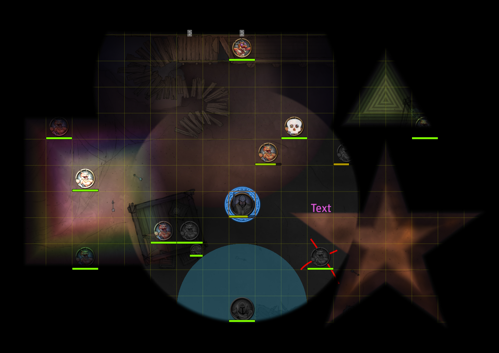
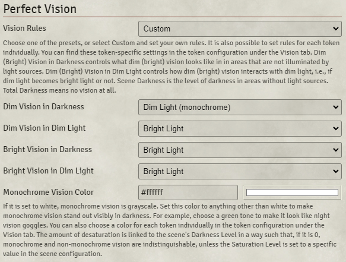
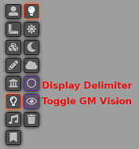
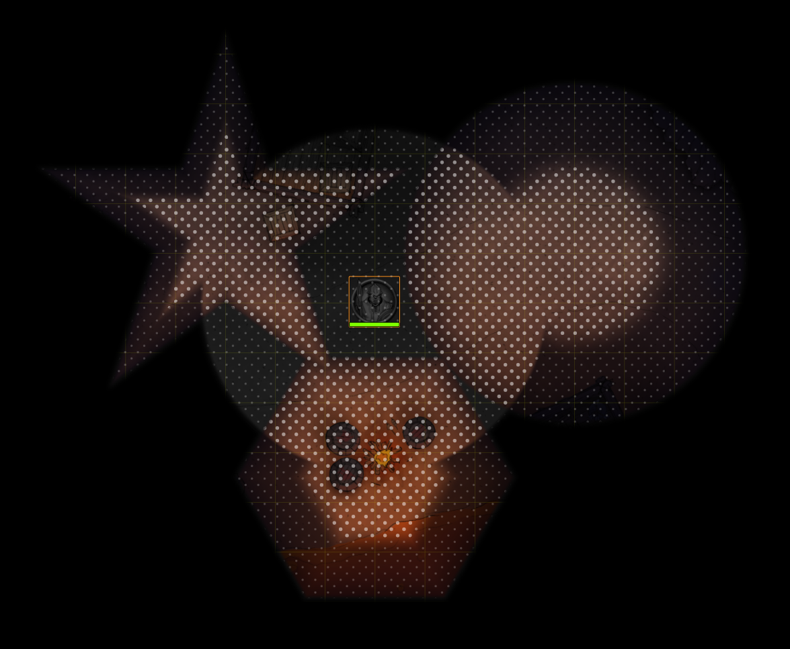
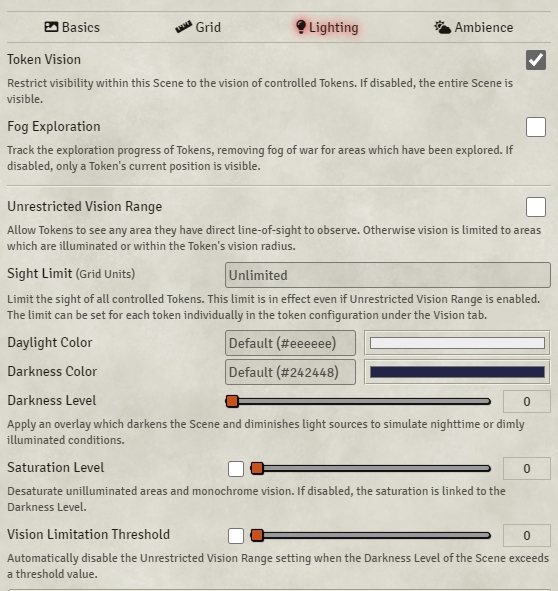
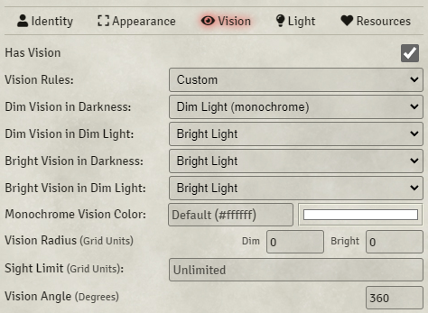
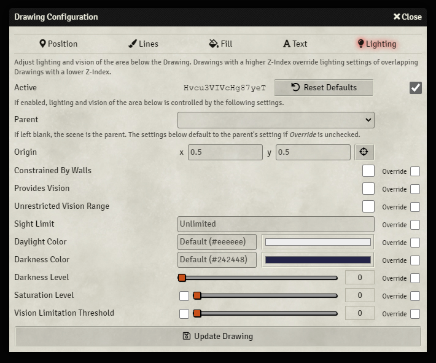
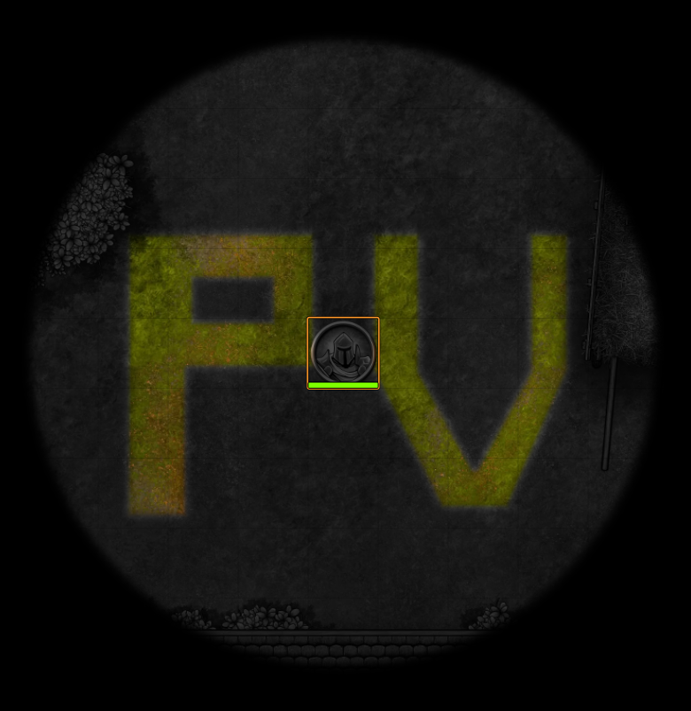

[](https://github.com/dev7355608/perfect-vision/releases/latest)

[](https://forge-vtt.com/bazaar#package=perfect-vision)
[](LICENSE)

# Perfect Vision (Foundry VTT Module)

## Feature Overview

Perfect Vision ...

- ... provides higher quality lighting than core Foundry VTT.
- ... accurately renders vision like *darkvision*, *low-light vision*, and *devil's sight*; presets for most major systems are included.
- ... adds a togglable GM vision mode that helps the GM to see clearly even if the scene is very dark.
- ... adds a togglable overlay that helps to distinguish between dim, bright, and no light easily.
- ... adds the ability to restrict the maximum distance a token can see, configurable per token, globally, or locally; you can use this feature to simply blind tokens and to create areas (magical darkness, fog, tall grass, or dense foliage, for example) that restrict vision to a certain distance. These areas can be defined by drawings, templates, or light sources.
- ... adds the ability to change daylight and darkness colors.
- ... adds the ability to change all lighting settings [locally](#drawing-configuration); that makes it possible to enable *Unrestricted Vision Range* outside, but disable it indoors, for example.
- ... renders the grid, drawings, token borders & auras, and turn markers in such away that these elements are not affected by lighting, and therefore remain clearly visible and colorful in dark scenes.
- ... changes the light animation to match the shaped lights of the [Light/Sound Mask](https://github.com/caewok/fvtt-light-mask) module.
- ... improves the quality of [FXMaster's](https://foundryvtt.com/packages/fxmaster) & [Weather Blocker's](https://github.com/theripper93/Weather-Blocker) weather masks and [Better Roofs](https://foundryvtt.com/packages/betterroofs) masks.
- ... makes [FXMaster's](https://foundryvtt.com/packages/fxmaster) weather effects interact with roof tiles just like core weather effects.
- ... is 100% compatible with [Levels](https://foundryvtt.com/packages/levels).
- ... is compatible with the Pathfinder 2e system's *rules-based vision*.



## Module Settings



- **Vision Rules**: Select one of the presets, or choose *Custom* set your own rules. It is also possible to set the rules for each token individually. You can find these token-specific settings in the token configuration under the *Vision* tab.

| System                   | Dim Vision        | Bright Vision |
| ------------------------ | ----------------- | ------------- |
| Dungeons & Dragons 5e    | Darkvision        | &mdash;       |
| Dungeons & Dragons 3.5e  | &mdash;           | Darkvision    |
| Pathfinder 1e            | &mdash;           | Darkvision    |
| Pathfinder 2e            | Low-light vision  | Darkvision    |
| Starfinder               | Low-light vision  | Darkvision    |

- **Dim (Bright) Vision in Darkness**: This setting controls what dim (bright) vision looks like  in areas that are not illuminated by light sources. *Scene Darkness* is the level of darkness in areas without light sources; it's the darkness controlled by *Darkness Level* in the scene configuration. *Total Darkness* means no vision at all.
- **Dim (Bright) Vision in Dim Light**: This controls how dim (bright) vision interacts with dim light, i.e., whether dim light becomes bright light.
- **Monochrome Vision Color**: If this setting is set to white, monochrome vision is grayscale. Set this color to anything other than white to make monochrome vision stand out visibly in darkness. For example, choose a green tone to make it look like night vision goggles. The amount of desaturation is linked to the scene's *Darkness Level* in a way such that, if it is 0, monochrome and non-monochrome vision are indistinguishable, unless the [*Saturation Level*](#scene-configuration) is set to a specific value in the scene configuration. You can also choose a color for each token individually in the token configuration under the *Vision* tab.


### Custom Vision Rules Example: *Devil's Sight*

Let's give a token *devil's sight*. Go to the *Vision* tab of the token configuration. Change *Vision Rules* from *D&D 5e* to *Custom*. Then set *Bright Vision in Darkness* to *Bright Light* (or *Bright Light (monochrome)*, if you prefer that) and *Bright Vision in Dim Light* to *Dim Light*. Finally set *Bright Vision* to 120.

## Scene Controls



- **Toggle GM Vision**: If enabled, brightens the scene and disables desaturation for the GM, but doesn't change anything while a token is controlled; so the GM still sees exactly what a player would see if they select a token that has vision. You can hover over the eye icon and scroll up/down to you adjust the brightness. Default keybinding is *CTRL+G*.
- **Toggle Delimiters**: Toggles an overlay that makes it easy to distinguish between dim, bright, and no light. Default keybinding is *CTRL+H*.



## Scene Configuration

You find these settings in the *Lighting* tab.



- **Reveal Fog**: Reveal the fog of war. The fog is revealed even if *Fog Exploration* is disabled. Revealing the fog doesn't explore the scene automatically.
- **Sight Limit**: Limits the sight of all tokens to the specified distance. This limit is in effect even if *Unrestricted Vision Range* is enabled. The limit can be set for each token individually in the token configuration under the *Vision* tab. You may find this script-macros useful to toggle the blindness of all controlled tokens:
```js
canvas.tokens.controlled.forEach(token => {
    if (Number.isFinite(token.document.getFlag("perfect-vision", "sightLimit"))) {
        token.document.unsetFlag("perfect-vision", "sightLimit");
    } else {
        token.document.setFlag("perfect-vision", "sightLimit", 0);
    }
});
```
- **Daylight and Darkness Colors**: These settings allow you to change the tint of daylight and darkness.
- **Saturation Level**: If the box is unchecked, the saturation is set to `1 - Darkness Level`; so, if *Darkness Level* is 0, monochrome and non-monochrome vision are indistinguishable, and, if *Darkness Level* is 1, monochrome vision is fully desaturated. If you don't want to link saturation to the *Darkness Level* in this way, simply check the box and set your preferred amount of saturation manually.

## Token Configuration

You find these settings in the *Vision* tab.



- **Vision Rules**: Same setting as in the [module settings](#module-settings). Defaults to the module settings' *Vision Rules*, if not set.
- **Dim (Bright) Vision in Darkness**: Same setting as in the [module settings](#module-settings).
- **Dim (Bright) Vision in Dim Light**: Same setting as in the [module settings](#module-settings).
- **Monochrome Vision Color**: Same setting as in the [module settings](#module-settings). Defaults to the module settings' *Monochrome Vision Color*, if not set.
- **Sight Limit**: Same setting as in the [scene configuration](#module-settings).

## Ambient Light Configuration

You find these settings in the *Advanced Options* tab.

- **Sight Limit**: Same setting as in the [scene configuration](#module-settings). If enabled, in the area of the light source tokens can see at least as far as the limit if the luminosity is greater or equal to zero, and can see at most as far as the limit if the luminosity is less than zero. Higher priority light sources that overlap with this light source can change the sight limit.

### Ambient Light Example 1: Magical Darkness

Create a light source and open the configuration and go to the *Advanced Options* tab. Set *Luminosity* to value below zero to create a dark light source. Then check the *Enable* box next to *Sight Limit* and set *Sight Limit* to 0. Now tokens won't be able to see though or inside the area of this light source. You probably want to uncheck *Constrained By Walls* as well if you are creating magical darkness according the D&D 5e rules. Done!

### Ambient Light Example 2: Daylight Spell

Create a light source and open the configuration and go to the *Advanced Options* tab. Check the *Enable* box next to *Sight Limit* and leave *Sight Limit* at *Unlimited*. Then set *Priority* to 20. This light sources removes the sight restrictions of the magical darkness light we created in the first example.

## Measured Template Configuration

- **Sight Limit**: Same setting as in the [scene configuration](#module-settings).

### Measured Template Example: Fog Cloud

Create a circle-shaped template and open the configuration. Check the *Enable* box next to *Sight Limit* and set *Sight Limit* to 0. Now tokens won't be able to see though or inside the area of this template. Done!

## Tile Configuration

You find these settings in the *Overhead* tab.

- **Roof Lighting**: If left blank, the roof is illuminated according to the scene's lighting settings. Otherwise, according to the chosen drawing's lighting settings.

## Drawing Configuration

You find these settings in the *Lighting* tab.

If you check the *Active* checkbox, lighting and vision of the area below the drawing is set by the settings below. Drawings with a higher *Z-Index* override the lighting settings of overlapping drawings with a lower Z-Index. You can choose any of the drawing shapes, but it is recommended to *not* use the freehand tool and instead to use the polygon tool; try to draw your area with the fewest amount of points possible, just like you would when you add walls to the scene. *Important:* make sure that the polygon you draw does not intersect itself!

The [Advanced Drawing Tools](https://github.com/dev7355608/advanced-drawing-tools) module allows you to edit polygon drawings, which comes in handy if you mess up your drawings.



- **Active**: If enabled, lighting and vision of the area below is controlled by the following settings. If disabled, then all children (and children's children ...) of the drawing are disabled as well, even if they are set to active. If the ID, which you find next to the *Reset Defaults* button, is red, the drawing is currently inactive.
- **Parent**: If left blank, the scene is the parent, otherwise you may choose another drawing as its parent by selecting the ID of the drawing. You find the ID of a drawing next to the *Reset Defaults* button in the *Lighting* tab. The settings below default to the parent's settings if *Override* is unchecked; settings with a *Override* checkbox are inherited from the parent unless this box is checked.
- **Fit To Walls**: If enabled, the area is fit to the underlying wall structure (room/building) automatically.
- **Constrained By Walls**: If enabled, the area is masked by the line-of-sight polygon. The origin of this polygon is set easily by clicking the crosshair button and then on the map. The origin is relative to the drawing, meaning it moves with it. The default (0.5, 0.5) is the center of the drawing.
- **Fog Exploration**: Same setting as in the [scene configuration](#scene-configuration).
- **Reveals Fog**: If enabled, the fog of war in this area is revealed. The fog is revealed even if *Fog Exploration* is disabled. Revealing the fog doesn't explore the area automatically. Explored areas are always revealed.
- **Provides Vision**: If enabled, any token has vision of this area regardless of line-of-sight restrictions. Same setting as in the light configuration.
- **Unrestricted Vision Range**: Same setting as in the scene configuration.
- **Sight Limit**: Same setting as in the [scene configuration](#scene-configuration).
- **Daylight and Darkness Colors**: Same setting as in the [scene configuration](#scene-configuration).
- **Darkness Level**: Same setting as in the scene configuration.
- **Saturation Level**: Same setting as in the [scene configuration](#scene-configuration).
- **Vision Limitation Threshold**: Same setting as in the scene configuration.



### Drawing Example 1: *Mixed Indoor/Outdoor Scene*

> [Video tutorial by bishopscott](https://www.youtube.com/watch?v=Ce2KeS4ww9o)

Assume you have a map with indoor and outdoor areas, and with daylight outside, but indoors it's dark. So outdoors everyone should be able to see everything in line-of-sight, but indoors only with light or darkvision. To set this up first go to the scene configuration and enabled *Unrestricted Vision Range*. Then select the polygon drawing tool (or any other tool) and draw over the indoors areas. You might need to create multiple drawings. I recommend to choose one of those drawings and set the parent of all other drawings to this drawing. This way you only have to configure the settings of the parent drawing, but not the children's except checking the *Active* checkbox and assigning the parent. In particular, I recommend create a drawing with the text tool, set the text to *Indoor Lighting*, move it to the padding of the scene so that your players can't see it, and choose this to be the parent; that makes it very easy to remember, which drawing is the parent that controls the indoor lighting settings. When you have finished creating your drawings, open the parent drawings settings, and check the *Override* box next to *Unrestricted Vision Range*; but leave the box next *Unrestricted Vision Range* unchecked, otherwise you enable it. You might want to change the *Darkness Level* as well: check the *Override* box next to *Darkness Level* and choose your preferred darkness for the indoor areas. Last but not least you probably want to make the drawings itself invisible to your players. Now, what if the time of changes and we want it to be nighttime outside? Simply go to the scene configuration, adjust the *Darkness Level* and disable *Unrestricted Vision Range*. If you want to change the lighting of the indoor areas, simply go to the parent drawing and make your changes.

### Drawing Example 2: Magical Darkness / Fog Cloud

> If you prefer, you can create magical darkness with a [light source](#ambient-light-example-1-magical-darkness) and a fog cloud with a [template](#measured-template-example-fog-cloud) instead.

Draw a circle with the ellipse tool (or any other shape). Open the drawings configuration, go to the *Lighting* tab, and check the *Active* checkbox. Then check the *Override* box next to *Sight Limit* and set *Sight Limit* to 0. Done! Tokens won't be able to see though or inside this area.
